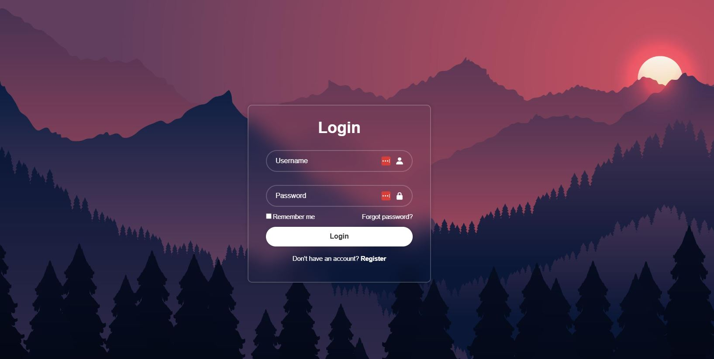

# Web Development - Modern Login Page

A clean, responsive login page with a glassmorphism effect, built with HTML and CSS.

## Features

- Sleek glassmorphism design with blur effect
- Fully responsive layout
- User-friendly form validation
- Password visibility toggle (can be added)
- "Remember me" and "Forgot password" options
- Smooth hover effects

## Technologies Used

- HTML5
- CSS3 (with modern properties like `backdrop-filter`)
- [Boxicons](https://boxicons.com/) for icons
- Google Fonts (Poppins)
